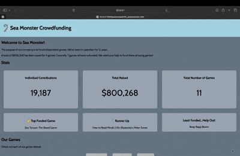

# WEB102 Prework - *SeaGame*

Submitted by: **Dishita Jhawar**

**SeaGame** is a website for the imaginary company Sea Monster Crowdfunding that displays information about the games they have funded. Building this website was a good exercise in reviewing HTML, CSS, and JS. 

Time spent: **8** hours spent in total

## Required Features

The following **required** functionality is completed:

* [ ] The introduction section explains the background of the company and how many games remain unfunded.
* [ ] The Stats section includes information about the total contributions and dollars raised as well as the top two most funded games.
* [ ] The Our Games section initially displays all games funded by Sea Monster Crowdfunding
* [ ] The Our Games section has three buttons that allow the user to display only unfunded games, only funded games, or all games.

The following **optional** features are implemented:

* [ ] The Stats section also includes information about the least funded game, to encourage users to donate to it. It is a 3rd box titled **"Least Funded... Help Out!"** and sorts the funding to output the least funded one. 

## Video Walkthrough

Here's a walkthrough of implemented features:

<!-- Replace this with whatever GIF tool you used! -->
GIF created with EzGif
<!-- Recommended tools:
[Kap](https://getkap.co/) for macOS
[ScreenToGif](https://www.screentogif.com/) for Windows
[peek](https://github.com/phw/peek) for Linux. -->

## Notes

It was initially challenging to remember certain JavaScript syntax, and to understand how the "spread" works in JS. It was a very good learning experience to review JavaScript through this prework. 

## License

    Copyright [2024] [Dishita Jhawar]

    Licensed under the Apache License, Version 2.0 (the "License");
    you may not use this file except in compliance with the License.
    You may obtain a copy of the License at

        http://www.apache.org/licenses/LICENSE-2.0

    Unless required by applicable law or agreed to in writing, software
    distributed under the License is distributed on an "AS IS" BASIS,
    WITHOUT WARRANTIES OR CONDITIONS OF ANY KIND, either express or implied.
    See the License for the specific language governing permissions and
    limitations under the License.
